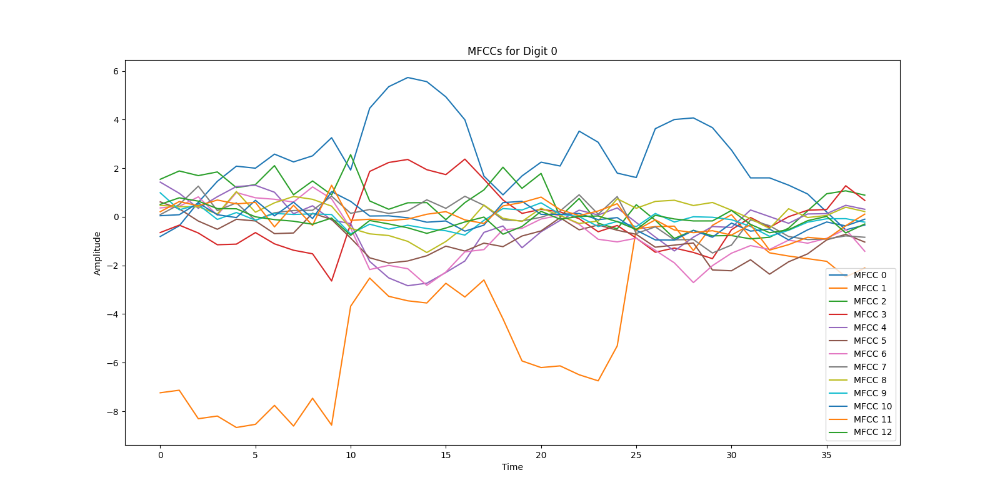

# **Introduction**

Speech recognition has changed the way we interact with technology. From asking Siri about the weather to commanding Alexa to turn off the lights, it’s everywhere! But what about something simpler—like recognizing spoken digits? Imagine saying "one, two, three" and having a system accurately understand and process those numbers. Sounds simple, right? Not quite.

This project dives into the fascinating world of **spoken digit recognition**, where we focus on identifying isolated numbers spoken aloud. To tackle this challenge, we use two powerful tools: **Gaussian Mixture Models (GMM)** and **Mel-Frequency Cepstral Coefficients (MFCCs)**. Together, they form a lightweight and efficient framework for extracting meaningful patterns from speech and classifying them accurately.


## **Background: How Speech Became Smart**

Speech recognition has come a long way. Back in the day, systems relied on methods like **Hidden Markov Models (HMM)** and **Dynamic Time Warping (DTW)** to process speech. These methods worked but struggled with variability—accents, noise, or even different speaking speeds could throw them off.

### **Why GMMs?**
Think of GMMs as statistical wizards. They model data as a mix of Gaussian distributions (bell curves!) and are great at capturing patterns in complex datasets. For speech recognition, they’re perfect for handling variability in features like pitch or tone.

### **What Are MFCCs?**
MFCCs are like the secret sauce of speech processing. Inspired by how humans hear sound, they transform raw audio signals into compact representations that focus on what matters most—the phonetic information. This makes them ideal for recognizing spoken digits.



*Figure 1: Overview of the speech recognition pipeline using GMMs and MFCCs.*

Mel-Frequency Cepstral Coefficients (MFCCs) are a popular choice for feature extraction in speech recognition tasks. They capture the essential characteristics of the audio signal, making it easier to classify spoken digits.

Specifically the MFCCs are calculated by using the discrete-time Fourier transform (DTFT) to convert the audio signal from the time domain to the frequency domain. The power spectrum of the signal is then mapped onto the mel scale, which emphasizes the frequencies that are more relevant to human speech perception. Finally, the MFCCs are obtained by applying the discrete cosine transform (DCT) to the log of the mel-filterbank energies.

A full pipeline for spoken digit recognition using MFCCs and GMMs involves the following steps:

```{mermaid}
graph LR
    A[Audio Signal] --> B(Pre-emphasis)
    B --> C(Framing and Windowing)
    C --> D(FFT)
    D --> E(Mel Filter Bank)
    E --> F(DCT)
    F --> G[MFCC Features]
    G --> H(GMM Training)
    H --> I[Classification]
```

---

## **Problem Statement**

Speech recognition systems often require substantial computational resources, making them unsuitable for embedded or low-power devices. This project addresses this challenge by answering:

1. Can we build a system that runs efficiently on resource-constrained devices?  
2. Can it achieve high classification accuracy for spoken digits?  

---

## **Methodology**

### 1. **MFCC Feature Extraction**

MFCCs are a compact representation of the speech signal, inspired by human auditory perception.

1. **Pre-emphasis:** Amplifies high frequencies.  
2. **Framing and Windowing:** Divides the signal and reduces spectral leakage.  
3. **Fast Fourier Transform (FFT):** Converts time-domain signals to the frequency domain.  
4. **Mel Filter Bank:** Emphasizes human-audible frequencies.  
5. **Discrete Cosine Transform (DCT):** Reduces dimensionality to retain essential coefficients.

  
*Figure 2: Process of extracting MFCC features from audio signals.*

---

### 2. **GMM for Probabilistic Modeling**

GMMs are used to model the distribution of MFCC features for each digit class. The process involves:

- **Training Phase:** Using Expectation-Maximization (EM) to fit GMMs for each digit.  
- **Classification Phase:** Computing the likelihood of test samples and classifying them based on maximum likelihood.

  
*Figure 3: Illustration of Gaussian distributions used in GMM clustering.*

---

## **Results**

The proposed system achieved high classification accuracy across all spoken digits while maintaining a lightweight computational footprint.

  
*Figure 4: Classification accuracy for spoken digits.*

---

## **Significance**

This lightweight, probabilistic framework demonstrates practical applications for speech recognition in resource-constrained environments, such as:

- Voice-controlled IoT devices  
- Banking authentication systems  
- Assistive technologies  

---

# **Conclusion**

By combining MFCC feature extraction with GMM modeling, this project demonstrates that speech recognition doesn’t always require deep learning. This lightweight system paves the way for speech applications on embedded and edge devices.

---

# **References**

<!-- Ensure your `references.bib` and `ieee.csl` files are up to date for citations. -->

---

This version is more visually engaging for a portfolio, with clear and relevant images from your `assets` folder replacing placeholder code. If you have additional assets or specific diagrams in mind, we can further enhance the visuals.